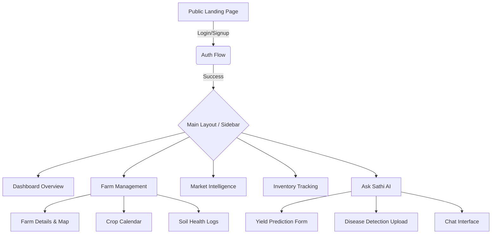

# 🌾 FasalSaathi - Frontend Application 💻


> **FasalSaathi Frontend** is a modern, responsive, and highly accessible Single Page Application (SPA) designed exclusively for the agricultural sector. It aggregates AI insights, real-time weather analytics, market trends, and precision farm management workflows into an intuitive, seamless user interface.


---

## 🎯 Project Overview

This application serves as the primary touchpoint for farmers and agricultural managers using the FasalSaathi platform. Built with a focus on high performance and user experience, it utilizes a Vite + React + TypeScript stack. State management and API data synchronization are handled effortlessly by Axios and TanStack React Query, ensuring the UI always reflects the most up-to-date data without manual refreshing.

---

## ✨ Key Features & Capabilities

* **📊 Dynamic Dashboard:** A unified control center rendering KPI cards, weather widgets, and recent alerts using clean Radix UI components.
* **🚜 Advanced Farm & Crop Workflows:** Interfaces to register land parcels, maintain soil health logs (pH, NPK), and visualize crop lifecycle calendars.
* **🤖 `Ask Sathi` AI Assistant:** A custom-built chat interface interfacing with Google Gemini backend, allowing farmers to query about crop health, pest control, and best practices in natural language.
* **🩺 Image-based Disease Detection:** A specialized workflow enabling users to upload leaf images directly via the browser for backend AI diagnosis and treatment recommendations.
* **📈 Live APMC Market Prices:** Interactive data tables and trend charts (using Recharts) for tracking localized commodity pricing.
* **🌦️ Interactive Weather Hub:** Displays current hyper-local weather conditions alongside 7-day visual forecasts.
* **📦 Smart Inventory Ledger:** CRUD interfaces to digitize farm stock (seeds, fertilizers, equipment) with low-stock warning indicators.
* **📱 Responsive & Accessible UI:** Mobile-first design implementation utilizing Tailwind CSS utilities and accessible Radix UI primitives.

---

## 📐 User Navigation & Flow

<details>
<summary><b>View Application Wireframe Map</b></summary>



</details>

---

## 🏗️ System Architecture & Tech Stack

| Domain | Technology / Library | Rationale |
| :--- | :--- | :--- |
| **Core Framework** | `React 18` + `TypeScript` | Strict typings and component-based rendering for massive scalability. |
| **Build Tooling** | `Vite` | Instant server start and lightning-fast HMR (Hot Module Replacement). |
| **Styling & UI Kit** | `Tailwind CSS` + `Radix UI` | Utility-first CSS combined with unstyled, highly accessible UI primitives (inspired by shadcn/ui). |
| **Network & State** | `Axios` + `TanStack Query (v5)` | Intercepts requests for JWT injection, handles caching, background fetching, and optimistic updates. |
| **Routing** | `React Router DOM v7` | Client-side declarative routing with nested layout structures. |
| **Forms & Validation**| `React Hook Form` | Performant, flexible, and extensible forms with easy-to-use validation. |
| **Visualizations** | `Recharts` | Composable charting library built on React components. |

---

## 📂 Project Structure

<details>
<summary><b>Click to expand</b></summary>

```text
fasalsaathi-frontend/
├── index.html               # Main HTML entry point
├── package.json             # NPM scripts and dependencies
├── vite.config.ts           # Vite configuration
├── tailwind.config.js       # Tailwind theme and plugin configuration
├── public/                  # Static assets (images, icons)
└── src/
    ├── main.tsx             # React DOM rendering and Context Providers
    ├── App.tsx              # React Router configuration
    ├── index.css            # Global Tailwind directives
    ├── components/          # Reusable Presentational Components
    │   ├── ui/              # Base UI library components (Buttons, Inputs, Dialogs)
    │   └── layout/          # Layout wrappers (Sidebar, Topbar)
    ├── pages/               # Route-level Container Components (Dashboard, Login, FarmView)
    ├── services/            # API integration layer
    │   └── api.ts           # Axios instance, interceptors, and typed API endpoints
    ├── hooks/               # Custom React hooks
    ├── context/             # Global React Contexts (Theme, Auth)
    └── types/               # Global TypeScript Interfaces and Types (`api.ts`)
```

</details>

---

## 🚀 Development Guide

<details>
<summary><b>Installation & Running Locally</b></summary>

### 1. Prerequisites
Ensure you have [Node.js](https://nodejs.org/) installed (v18+ recommended).

### 2. Install Dependencies
```bash
# Navigate to the frontend directory
cd fasalsaathi-frontend

# Install node modules
npm install
```

### 3. Environment Variables
Create a `.env` file at the root of the frontend project:
```env
# The Base URL for the FasalSaathi FastAPI backend
VITE_API_BASE_URL=http://localhost:8000/api/v1
```

### 4. Available Scripts
* **`npm run dev`**: Starts the Vite development server with HMR on `http://127.0.0.1:3000`.
* **`npm run build`**: Compiles TypeScript and builds the app for production into the `dist/` folder.
* **`npm run preview`**: Boots up a local static web server to preview the production build.

</details>

---

## 🔌 API Service Layer Architecture

The frontend abstracts all backend communications via `src/services/api.ts`.

* **Axios Interceptors:** Automatically attaches the `Bearer {token}` from `localStorage` to every outgoing request. It globally catches `401 Unauthorized` responses and redirects the user to `/login` to ensure security boundaries are maintained.
* **Typed Endpoints:** Every API call explicitly types its request payloads and return responses using TS interfaces defined in `src/types/api.ts` (e.g., `CropDetailResponse`, `DashboardOverview`).
* **Modularization:** The service exports modules like `authApi`, `farmApi`, `marketApi`, allowing components to import only what they need.

---

## 🤝 Contributing Guidelines

1. **Component Driven:** When adding a new feature, build purely presentational components in `src/components/` and stateful container components in `src/pages/`.
2. **Styling Consistency:** Strictly use Tailwind CSS utility classes. Avoid creating custom CSS files unless absolutely necessary for complex animations. Use Radix UI primitives for accessible interactive elements.
3. **Data Fetching:** Always use `useQuery` or `useMutation` from TanStack Query for remote data instead of basic `useEffect` fetch calls. This ensures proper caching, loading states, and error handling.
4. **Types:** Define all API payload/response interfaces in `src/types/api.ts`. Do not use `any` types.

---
*Bridging the gap between agriculture and technology.*